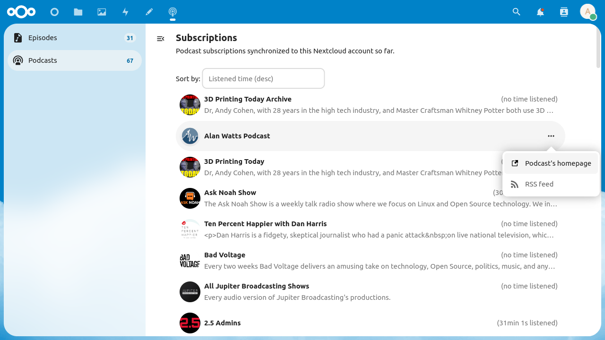

# NextPod Nextcloud App

[GitHub](https://github.com/pbek/nextcloud-nextpod) |
[Nextcloud App Store](https://apps.nextcloud.com/apps/nextpod) |
[Changelog](https://github.com/pbek/nextcloud-nextpod/blob/main/CHANGELOG.md)

This Nextcloud app lets you visualize your podcast subscriptions and episode downloads from
[GPodderSync](https://apps.nextcloud.com/apps/gpoddersync), which acts as a basic gpodder.net
api to sync podcast consumer apps (podcatchers) like AntennaPod.

You need to have [GPodderSync](https://apps.nextcloud.com/apps/gpoddersync) installed to use this app!

## Screenshots

### Episode List

### Episode Description

### Podcast Subscriptions

## Clients supporting sync of GPodderSync

| client | support status |
| :- | :- |
| [AntennaPod](https://antennapod.org) | Initial purpose for this project, as a synchronization endpoint for this client.  Support is available [as of version 2.5.1](https://github.com/AntennaPod/AntennaPod/pull/5243/). |
| [KDE Kasts](https://apps.kde.org/de/kasts/) | Supported since version 21.12 |
| [Garmin Podcasts](https://lucasasselli.github.io/garmin-podcasts/) | Only for [compatible Garmin watches](https://apps.garmin.com/en-US/apps/b5b85600-0625-43b6-89e9-1245bd44532c), supported since version 3.3.4 |

## Installation

Either from the official Nextcloud app store ([link to app page](https://apps.nextcloud.com/apps/nextpod)) or by
downloading the [latest release](https://github.com/pbek/nextcloud-nextpod/releases/latest) and extracting it into
your Nextcloud `apps/` directory.

## Development

See [docker/README.md](./docker/README.md) for development instructions.
